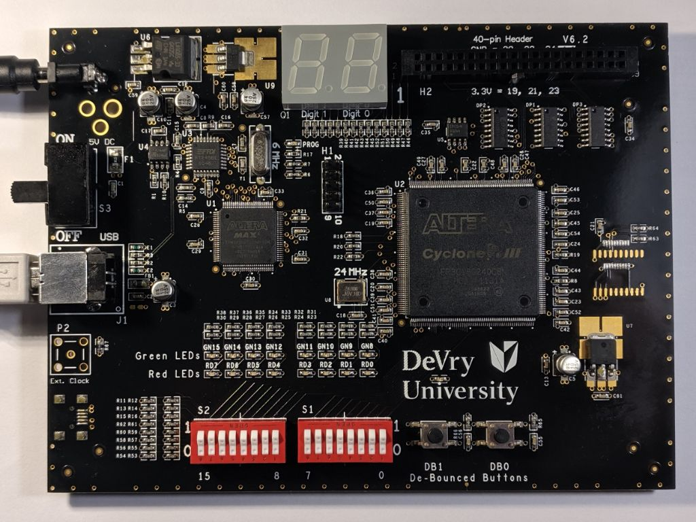

# eSOC-III
Collection of my projects and docs for the DeVry eSOC III FPGA Dev Board (Altera Cyclone III EP3C16Q240C8).

## Projects:
1. Blink LED
    * Toggles green LED labeled "GN8".
    * Uses a counter to count number of clock cycles. Time is based on 24 MHz clock.
2. 4-bit ALU
    * ALU calculates sum, product, remainder, and bitwise AND of two 4-bit inputs.
    * Inputs represented in binary using DIP switches
    * 8 green LEDs represent 8-bit ALU result  
3. Clock Divider 
    * TODO

## Setup
* TODO
---
## Helpful resources
1. [FPGA Tutorial: Blink an LED (Video)](https://youtu.be/Qd01NJi1AnY)
    * Quick intro to Quartus II workflow and getting code onto FPGA

2. [Learning Verilog for FPGA Development (Paid LinkedIn Learning Course)](https://www.linkedin.com/learning/learning-verilog-for-fpga-development)
    * Short and concise intro to Verilog HDL with a few challenges. About a 2-3 hours to complete.
    * Paid course but I got free access through a promotion from LinkedIn.
